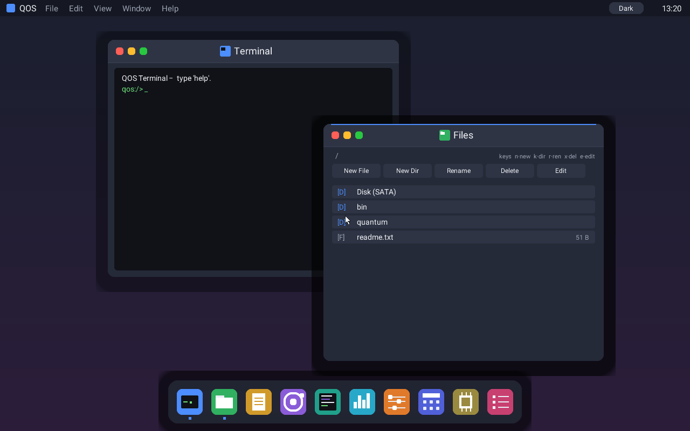
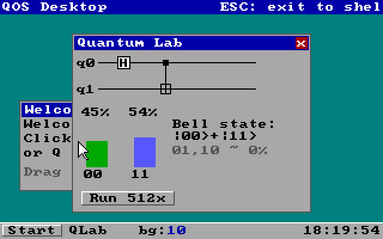
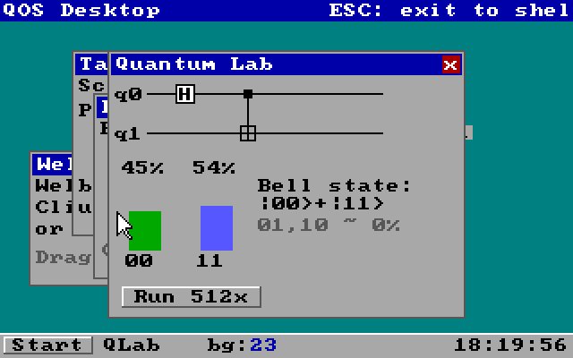

# QOS — Quantum Operating System

QOS is a bare-metal, `no_std` operating system written in Rust for the x86_64 architecture. It
pairs a small, modern OS kernel with a first-class **quantum control plane**: the long-term goal
is an OS that is a usable, Windows-like desktop *and* the classical control plane for quantum
workloads (local simulation today, cloud QPUs and a future QPU accelerator over time).

> Status: actively developed. The kernel boots, preemptively multitasks isolated user processes,
> and presents an interactive graphical desktop. See [docs/PLAN.md](docs/PLAN.md) for the roadmap
> and [docs/adr/](docs/adr/) for the architecture decisions.

## Screenshots

| Desktop | Quantum Lab | Multi-window |
|---|---|---|
|  |  |  |

The taskbar shows a live background-task counter and clock — a real preemptive kernel thread
running behind the GUI. The Quantum Lab runs a Bell-state circuit on the in-kernel statevector
simulator and plots the measurement histogram.

## Highlights

- **Preemptive multitasking** — timer-driven context switching for kernel threads and Ring-3
  user processes.
- **Process isolation** — per-process page tables, W^X memory protection, and fault isolation: a
  crashing or runaway user process is killed without taking down the kernel or other processes.
- **Two syscall ABIs** — a register-based ABI (`int 0x81`: `rax`=number, `rdi`/`rsi`=args) and a
  shared-memory ABI (`int 0x80`) used by the quantum demo.
- **Graphical desktop** — VGA Mode 13h framebuffer, mouse cursor, draggable/closable windows,
  buttons and menus, a Start menu, and apps (Quantum Lab, Task Monitor, About, Files).
- **In-kernel quantum simulator** — a real statevector simulator with an OpenQASM subset and a
  Quantum Hardware Abstraction Layer (QHAL) designed for future cloud/QPU backends.
- **IPC** — an in-kernel pipe primitive.

## Quick start (Windows + QEMU)

Prerequisites: the pinned Rust toolchain (installed automatically from `rust-toolchain.toml`),
[`cargo-bootimage`](https://github.com/rust-osdev/bootimage), and
[QEMU](https://www.qemu.org/) (`qemu-system-x86_64`).

```powershell
cargo install bootimage      # one-time
./run-qos.ps1 -Build         # build the boot image and launch QEMU
```

`run-qos.ps1` handles two Windows gotchas automatically: it finds QEMU even when it is not on
`PATH`, and it copies the boot image to an ASCII-only temp path (non-ASCII repo paths corrupt
QEMU's arguments). Add `-Serial` to mirror the guest serial log in your terminal.

At the shell prompt, type `gdesk` for the graphical desktop. **Click inside the QEMU window to
capture the mouse** (a relative PS/2 mouse only moves once captured; `Ctrl+Alt+G` releases it).

### Try the OS-core demos

From the shell (or run with `./run-qos.ps1 -Build -Serial` to watch the output):

| Command | What it demonstrates |
|---|---|
| `gdesk` | Graphical desktop (Q = Quantum Lab, R = run, M = Task Monitor, F = Files, D = Display, A = About, ESC = exit). Renders on the UEFI/VESA linear framebuffer (scaled from 320×200), falling back to VGA Mode 13h. |
| `threadtest` | Preemptive context switching between two kernel threads |
| `proctest` | Two isolated Ring-3 processes preempted concurrently |
| `faulttest` | A crashing process is killed; the kernel and other processes survive |
| `exittest` | A process exits cleanly via syscall and control returns to the shell |
| `regabitest` | The register-based syscall ABI (`int 0x81`) |
| `wxtest` | W^X enforcement (a write to a code page faults) |
| `ipctest` | A producer/consumer pair over a kernel pipe |

## Build & verify (cross-platform)

```sh
# Run the portable control-plane core's tests (host target)
cargo test -p qos-core --features std

# Build the bare-metal kernel
cargo os-build              # = cargo build -p os --target x86_64-unknown-none -Zbuild-std=core,alloc

# Build a bootable image
cargo os-bootimage          # = cargo bootimage -p os --target x86_64-unknown-none

# Headless verification (boots, runs the Ring-3 quantum demo, exits with a status code)
cargo os-verify
```

A Docker-based build is also available (see `Dockerfile` / `docker-compose.yml`) for a clean,
reproducible Linux toolchain.

## Running on real hardware and VMs

QOS boots via legacy BIOS and can run in VirtualBox/VMware or from a USB stick (with Legacy/CSM
enabled). See [docs/HARDWARE.md](docs/HARDWARE.md) for the support matrix, disk-image formats
(`dist/qos.vdi` / `.vmdk` / `.img`), and current limitations (UEFI is planned, not yet supported).

## Architecture

- `crates/qos-os-kernel` (package `os`) — the bare-metal kernel: scheduler, paging, interrupts,
  drivers, the graphical desktop, and the in-kernel quantum simulator.
- `crates/qos-core` — a portable (`no_std + alloc`, optional `std`) control-plane core:
  `JobManager`, scheduler, event log, and the Quantum Hardware Abstraction Layer (QHAL).
- `crates/qos-abi` — shared ABI types (job handles, process specs, result status).

Design decisions are recorded as Architecture Decision Records in [docs/adr/](docs/adr/). Start
with ADR-0002 (QPU control-plane framing) and ADR-0003 (layered architecture).

## Contributing

Contributions are welcome — see [CONTRIBUTING.md](CONTRIBUTING.md) and
[CODE_OF_CONDUCT.md](CODE_OF_CONDUCT.md). All repository content is in English.

## License

QOS is licensed under the **PolyForm Noncommercial License 1.0.0** — a source-available license
that permits use, modification, and distribution for **noncommercial purposes only**. Commercial
use is not permitted under this license. See [LICENSE](LICENSE) for the full terms; for commercial
licensing, contact **contact@heptapusgroup.com**.

Note: this is a *source-available* license, not an OSI-approved open-source license. The project's
dependencies (e.g. `bootloader`, `x86_64`, `spin`) are permissively licensed (MIT / Apache-2.0),
which is compatible with QOS adopting a more restrictive license. Licensing questions are best
confirmed with a legal review.
