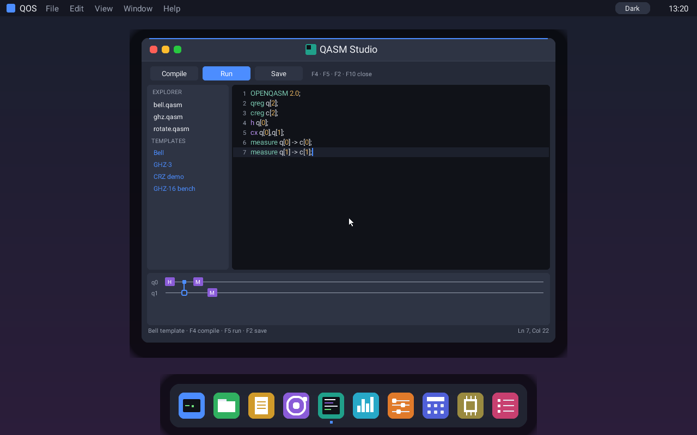
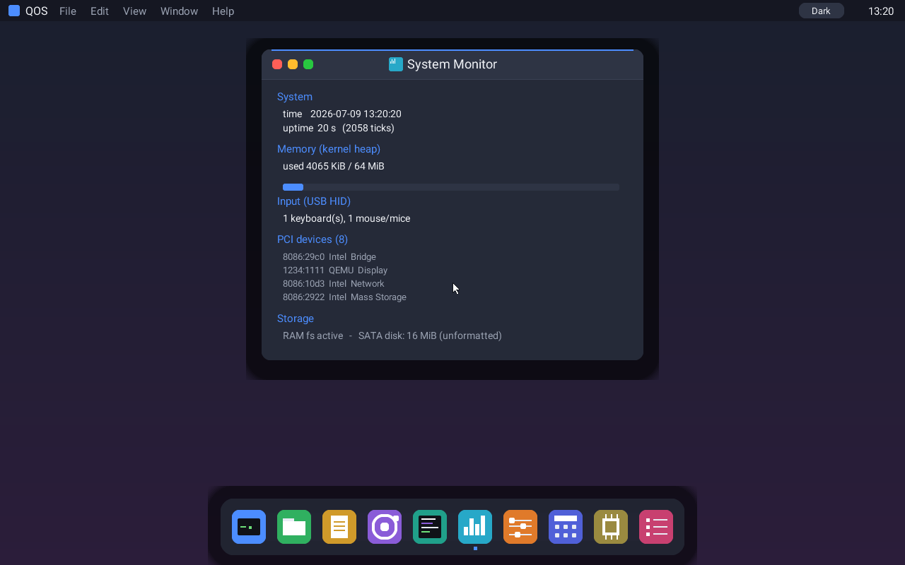
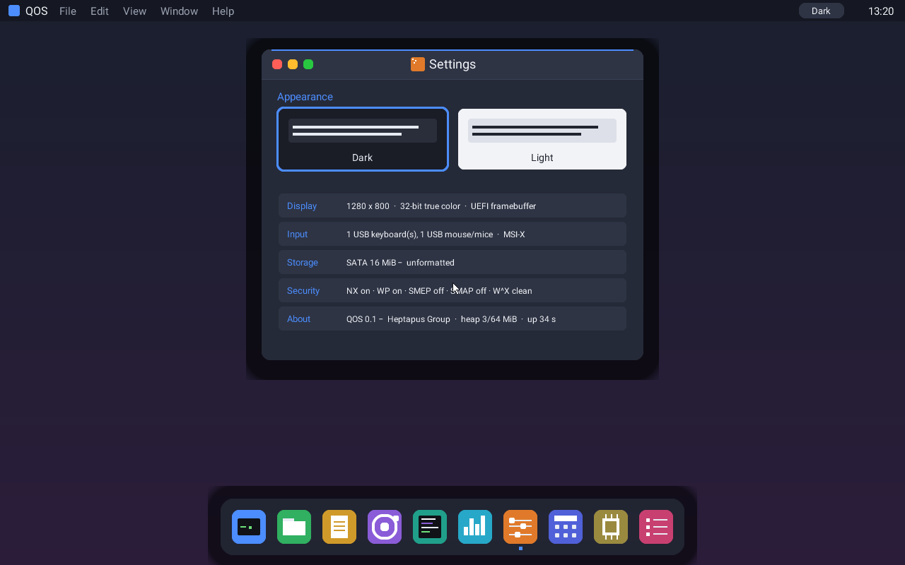

# QOS — Quantum Operating System

QOS is a bare-metal, `no_std` operating system written in Rust for **UEFI x86-64**. It pairs a
small, modern OS kernel with a first-class **quantum control plane**: the long-term goal is an OS
that is a usable, modern desktop *and* the classical control plane for quantum workloads (local
statevector simulation today; cloud QPUs over time). It is designed to be **quantum-safe** — the
cryptography that will secure its cloud and update paths is planned around NIST post-quantum
standards (see [WP-13](docs/wp/WP-13-quantum-safe-security.md)).

> **Status: actively developed, experimental.** The kernel boots on UEFI, preemptively
> multitasks, isolates Ring-3 user processes, persists files to a SATA disk, and presents an
> interactive true-color desktop with ten apps including a quantum circuit lab and a QASM IDE.
> It is verified under QEMU+OVMF; real-hardware validation is in progress (ADR-0014 Stage 4).
> See [docs/MASTERPLAN.md](docs/MASTERPLAN.md) for the roadmap, [docs/wp/](docs/wp/) for the work
> packages, and [docs/adr/](docs/adr/) for the architecture decisions.

## Screenshots

| Modern desktop | Quantum Lab | QASM Studio IDE |
|---|---|---|
|  |  |  |

| System Monitor | Settings |
|---|---|
|  |  |

The desktop renders at the firmware's native resolution (1280×800, 32-bit true color) through a
double-buffered compositor with scalable TrueType fonts. The **Quantum Lab** builds a circuit
visually and runs it on the in-kernel statevector simulator — the GHZ state above sampled
529×`000` / 471×`111` over 1000 shots, executed on a **background kernel thread** while the UI
stayed live. **QASM Studio** is an in-OS IDE: line-numbered OpenQASM editing with syntax
highlighting, templates, live circuit preview, and inline diagnostics.

## Highlights

- **UEFI boot + compositor desktop** — boots via bootloader 0.11 on a linear framebuffer
  (ADR-0014); a double-buffered, damage-tracked compositor with scalable TTF fonts, a dock, a
  menu bar, and draggable/closable windows (ADR-0017).
- **Ten built-in apps** — Terminal, Files, Text Editor, Quantum Lab, QASM Studio, System Monitor,
  Settings, Calculator, Devices, and Processes.
- **Preemptive multitasking** — APIC-timer-driven context switching for kernel threads and Ring-3
  user processes; heavy quantum jobs run on a background worker without freezing the desktop.
- **Process isolation + hardening** — per-process page tables, **W^X** memory protection
  (audited: 0 writable-and-executable pages), NX/WP with CPUID-gated SMEP/SMAP (ADR-0020), and
  fault isolation: a crashing user process is killed without taking down the kernel.
- **Persistent storage** — an AHCI/SATA DMA driver with a native flat filesystem (QOSFS) that
  survives reboots, plus a RAM filesystem, behind a growing unified VFS (ADR-0018, WP-09).
- **In-kernel quantum engine** — an in-place O(2ⁿ) statevector simulator, an OpenQASM 2.0 subset
  parser with angle expressions, transpiler optimization passes (gate cancellation, rotation
  merging), and a Quantum Hardware Abstraction Layer (QHAL) designed for future cloud/QPU
  backends (ADR-0019/0021).
- **Modern platform** — ACPI/APIC discovery, PCI enumeration, xHCI USB with HID keyboard/mouse
  (ADR-0015); PS/2 and PIC kept as graceful fallbacks.
- **Quantum-safe by design** — the cryptography roadmap (provider channels, signed updates,
  sealed secrets) targets NIST PQC (ML-KEM, ML-DSA/SLH-DSA), hybridized with classical crypto
  during the transition (WP-13).

## Quick start (Windows + QEMU)

Prerequisites: the pinned Rust toolchain (installed automatically from `rust-toolchain.toml`) and
[QEMU](https://www.qemu.org/) (`qemu-system-x86_64`), which ships the OVMF/`edk2` UEFI firmware
used to boot.

```powershell
./run-qos-uefi.ps1 -Build    # build the UEFI image (cargo image) and launch QEMU + OVMF
```

QOS boots via **UEFI** on a linear framebuffer. `run-qos-uefi.ps1` handles the Windows gotchas:
it finds QEMU and the bundled OVMF firmware even when not on `PATH`, uses a writable per-run copy
of the UEFI variable store, attaches a persistent SATA data disk, and copies everything to an
ASCII-only temp path (non-ASCII repo paths corrupt QEMU's arguments). Add `-Serial` to mirror the
guest serial log in your terminal.

At the boot splash, press **Enter** for the modern desktop (or **S** for a text shell). On the
desktop, keys **1–9, 0** open the dock apps, **F10** closes the focused window, and **Esc**
returns to the shell. **Click inside the QEMU window to capture the mouse** (a relative USB mouse
only moves once captured; `Ctrl+Alt+G` releases it).

## Build & verify (cross-platform)

```sh
# Run the portable control-plane core's tests (host target)
cargo test -p qos-core --features std

# Build the bare-metal kernel
cargo os-build              # = cargo build -p os --target x86_64-unknown-none -Zbuild-std=core,alloc

# Build a bootable UEFI image (written to dist/qos-uefi.img)
cargo image

# Headless verification (boots, runs the Ring-3 quantum demo, exits with a status code)
cargo os-verify
```

A Docker-based build is also available (see `Dockerfile` / `docker-compose.yml` and
[DOCKER.md](DOCKER.md)) for a clean, reproducible Linux toolchain.

## Running on real hardware and VMs

Write `dist/qos-uefi.img` to a USB stick and boot it on a **UEFI** machine, or attach it to a
UEFI VM (QEMU+OVMF, and the major hypervisors in UEFI mode). It has been verified to boot to the
desktop under QEMU+OVMF on both the `q35` and `pc` machine types. See
[docs/HARDWARE.md](docs/HARDWARE.md) for the support matrix. Real-hardware/USB validation is
Stage 4 of ADR-0014 (in progress) — the README does not claim hardware support beyond what the
matrix records.

## Architecture

- `crates/qos-os-kernel` (package `os`) — the bare-metal kernel: scheduler, paging, interrupts,
  drivers (AHCI, xHCI, PCI, APIC, NIC), the compositor desktop and its apps, and the in-kernel
  quantum engine + QASM toolchain.
- `crates/qos-core` — a portable (`no_std + alloc`, optional `std`) control-plane core:
  `JobManager`, scheduler, event log, and the Quantum Hardware Abstraction Layer (QHAL).
- `crates/qos-ui` — the compositor primitives: surfaces, fonts, drawing.
- `crates/qos-abi` — shared ABI types (job handles, process specs, result status).

Design decisions are recorded as Architecture Decision Records in [docs/adr/](docs/adr/). Start
with ADR-0002 (QPU control-plane framing) and ADR-0003 (layered architecture).

## Contributing

Contributions are welcome — see [CONTRIBUTING.md](CONTRIBUTING.md) and
[CODE_OF_CONDUCT.md](CODE_OF_CONDUCT.md). All repository content is in English. Work is tracked as
GitHub issues (grouped by milestone) and mirrored in [docs/wp/](docs/wp/); pick one labelled
`good first issue` or any open work package to start.

For security-sensitive reports, see [SECURITY.md](SECURITY.md) and avoid posting exploit details
or credentials in public issues.

## License

QOS is licensed under the **GNU Affero General Public License v3.0** (AGPL-3.0-only) — a strong
copyleft, OSI-approved open-source license. You may use, study, modify, and redistribute QOS,
**including commercially**, provided that derivative works — and network services built on
QOS — are made available under the same license with source and notices preserved. See
[LICENSE](LICENSE) for the full terms.

Copyright © Heptapus Group. QOS's dependencies (e.g. `bootloader`, `x86_64`, `spin`) are
permissively licensed (MIT / Apache-2.0), which is compatible with distributing QOS under the
AGPL. Licensing questions about a specific use are best confirmed with a legal review.
